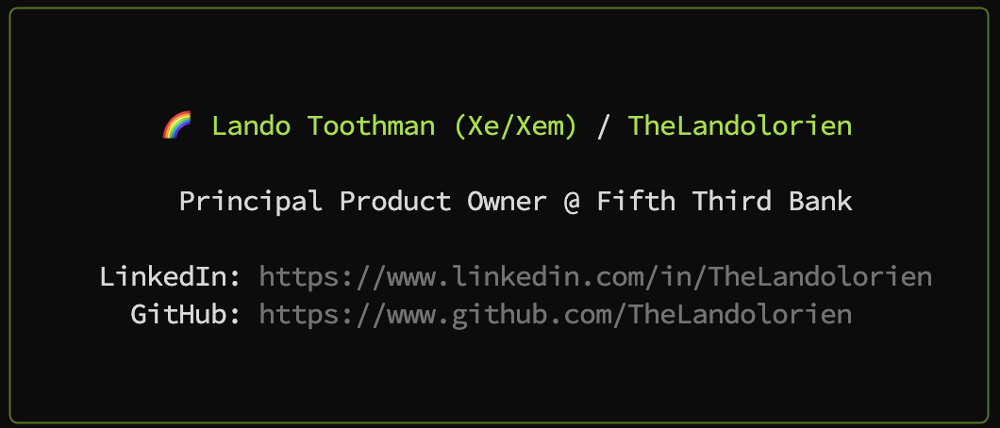

# TheLandolorien Card

<div align="center">
    
    <p>An npx Business Card for <a href="https://github.com/TheLandolorien">TheLandolorien</a></p>

Based on [create-profile-card CLI](https://github.com/agneym/create-profile-card) by [@agneym](https://github.com/agneym)

</div>

## ⌨️ Usage

```Shell
npx [--yes] thelandolorien
```
